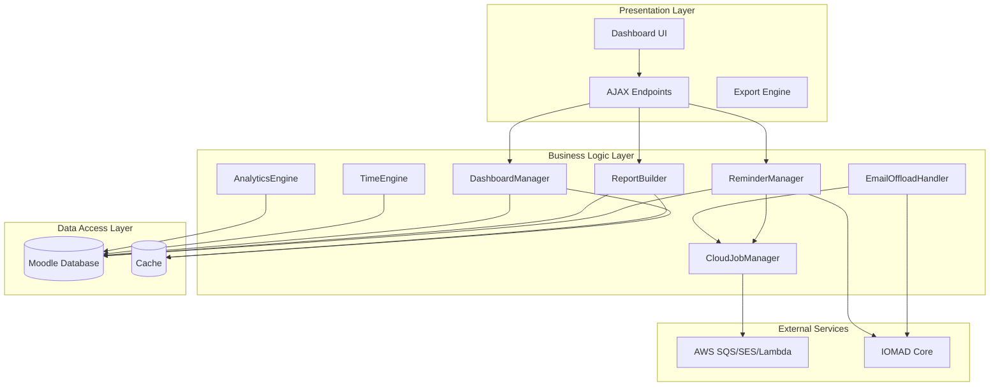
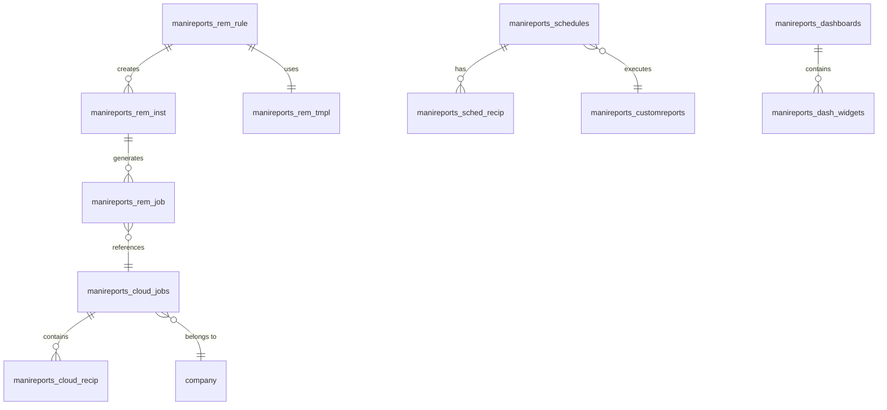

# ManiReports Plugin - Comprehensive Documentation

**Version:** 1.0.0-beta  
**Plugin Component:** local_manireports  
**Moodle Version:** 4.0 - 4.4 LTS  
**Maturity:** BETA  
**Date:** December 2024

---

## Table of Contents

1. [Executive Summary](#executive-summary)
2. [Plugin Overview](#plugin-overview)
3. [Core Features](#core-features)
4. [System Architecture](#system-architecture)
5. [Database Schema](#database-schema)
6. [Cloud Offload System](#cloud-offload-system)
7. [Reminder & Re-engagement System](#reminder--re-engagement-system)
8. [Dashboard & Analytics](#dashboard--analytics)
9. [Reporting Engine](#reporting-engine)
10. [Technical Implementation](#technical-implementation)
11. [Security & Performance](#security--performance)
12. [Deployment & Configuration](#deployment--configuration)
13. [Future Roadmap](#future-roadmap)

---

## Executive Summary

**ManiReports** is an advanced reporting and analytics plugin for Moodle LMS with specialized support for IOMAD multi-tenancy environments. The plugin provides comprehensive learning analytics, automated reminder systems, cloud-based email offloading, and customizable dashboards for administrators, managers, teachers, and students.

### Key Achievements

- **19 Database Tables** supporting comprehensive data tracking and analytics
- **Cloud Offload System** for scalable email delivery via AWS SES/SQS
- **Intelligent Reminder System** with rule-based automation and multi-recipient support
- **6 Scheduled Tasks** for automated data aggregation and maintenance
- **Multi-role Dashboards** with glassmorphic UI design
- **Custom Report Builder** with SQL and GUI-based report creation
- **IOMAD Integration** with company-scoped data isolation

---

## Plugin Overview

### Purpose

ManiReports addresses critical gaps in Moodle's native reporting capabilities by providing:

1. **Advanced Analytics**: Real-time engagement tracking, completion trends, and at-risk learner detection
2. **Automated Communication**: Rule-based reminder system with cloud offloading for scalability
3. **Multi-tenancy Support**: Full IOMAD integration with company-level data isolation
4. **Performance Optimization**: Intelligent caching, pre-aggregation, and query optimization
5. **Customization**: Flexible report builder and dashboard configuration

### Target Users

| Role | Primary Use Cases |
|------|------------------|
| **Administrators** | System monitoring, company analytics, cloud job management, audit logs |
| **Managers** | Team performance tracking, at-risk learner intervention, reminder management |
| **Teachers** | Course analytics, student engagement, completion tracking |
| **Students** | Personal progress tracking, course completion status |

---

## Core Features

### 1. Dashboard System

#### Admin Dashboard
- **KPI Cards**: New registrations, active users, course completions, average engagement
- **Dynamic Charts**: Completion trends, engagement by course, department performance
- **User Activity Heatmap**: Visual representation of learning patterns
- **System Health Monitoring**: Performance metrics, cache hit rates, concurrent usage

#### Manager Dashboard
- **Company-Scoped Analytics**: Filtered by IOMAD company context
- **Team Performance**: Enrollment trends, completion rates, engagement scores
- **At-Risk Learners**: Automated detection with intervention tracking
- **Reminder Status**: Unified view of all active reminder campaigns

#### Teacher Dashboard
- **Course Analytics**: Student progress, activity completion, engagement metrics
- **Student Performance**: Individual learner tracking with drill-down capabilities
- **SCORM Analytics**: Pre-aggregated SCORM tracking data

#### Student Dashboard
- **Personal Progress**: Course completion status, time spent, achievements
- **Upcoming Deadlines**: Activity due dates and reminders
- **Engagement Metrics**: Self-assessment tools and progress visualization

### 2. Reminder & Re-engagement System

#### Rule-Based Automation
```
Trigger Types:
├── Enrollment-based: Send X days after enrollment
├── Start Date-based: Send X days after course start
├── Incomplete After: Send if activity incomplete after X days
└── Custom: Flexible date/time-based triggers
```

#### Multi-Recipient Support
- **Learners**: Direct email to enrolled users
- **Managers**: IOMAD company managers (course-scoped)
- **Third-party**: External email addresses (HR, supervisors)
- **CC Recipients**: Additional stakeholders

#### Email Template Engine
- **Company-Specific Templates**: Customizable per IOMAD company
- **Dynamic Placeholders**: User name, course name, deadline, password, etc.
- **HTML & Plain Text**: Dual-format support for compatibility
- **Template Library**: Reusable templates with versioning

#### Reminder Instance Tracking
- **State Management**: Tracks each user's reminder progress
- **Completion Detection**: Automatically stops reminders on goal completion
- **Retry Logic**: Configurable retry attempts for failed sends
- **Audit Trail**: Complete history of all reminder attempts

### 3. Cloud Offload System

#### Architecture Overview
```
┌─────────────────┐
│  Moodle Event   │
│  (user_created, │
│ license_assigned)│
└────────┬────────┘
         │
         ▼
┌─────────────────┐
│ Event Observer  │
│ (EmailOffload   │
│    Handler)     │
└────────┬────────┘
         │
         ├──► Is Cloud Enabled? ──No──► Standard Moodle Email
         │
         Yes
         │
         ▼
┌─────────────────┐
│ CloudJobManager │
│ - Create Job    │
│ - Queue to SQS  │
└────────┬────────┘
         │
         ▼
┌─────────────────┐
│   AWS Lambda    │
│ - Process Queue │
│ - Send via SES  │
│ - Callback      │
└────────┬────────┘
         │
         ▼
┌─────────────────┐
│ Moodle Callback │
│ - Update Status │
│ - Log Results   │
└─────────────────┘
```

#### Supported Events
1. **User Created**: New user registration with temporary password
2. **License Allocated**: IOMAD license assignment notifications
3. **Reminder Emails**: Scheduled re-engagement campaigns

#### Cloud Providers
- **AWS**: SQS (queue) + SES (email delivery) + Lambda (processing)
- **Cloudflare** (planned): Workers + Email Routing

#### Benefits
- **Scalability**: Handle bulk imports (1000+ users) without blocking Moodle
- **Reliability**: Retry logic and failure tracking
- **Performance**: Offload email processing from Moodle server
- **Monitoring**: Real-time job status and delivery tracking

### 4. Custom Report Builder

#### SQL Report Builder
- **Visual Query Builder**: Drag-and-drop interface for non-technical users
- **Direct SQL**: Advanced users can write custom queries
- **SQL Whitelist**: Security validation against approved tables
- **Parameter Support**: Dynamic filters (date range, company, course)

#### GUI Report Builder
- **Pre-built Templates**: Common report types (enrollment, completion, engagement)
- **Configurable Columns**: Select and order data fields
- **Aggregation Functions**: SUM, AVG, COUNT, MIN, MAX
- **Grouping & Sorting**: Multi-level data organization

#### Export Formats
- CSV (Comma-Separated Values)
- XLSX (Excel)
- PDF (Formatted reports)

### 5. Scheduled Reports

#### Automation Features
- **Frequency Options**: Daily, weekly, monthly, custom intervals
- **Email Distribution**: Multiple recipients per schedule
- **Cloud Preference**: Auto, force cloud, force local
- **Failure Handling**: Retry logic with exponential backoff

#### Report Types Supported
- Pre-built reports (enrollment, completion, engagement)
- Custom SQL reports
- Custom GUI reports

### 6. Time Tracking System

#### Real-time Tracking
- **Heartbeat Mechanism**: JavaScript-based activity detection (25s interval)
- **Session Management**: Automatic session creation and timeout (10 min)
- **Course-Level Tracking**: Time spent per course
- **Daily Aggregation**: Pre-computed summaries for performance

#### Data Storage
```
Active Sessions (manireports_time_sessions)
    ↓ (Hourly Aggregation Task)
Daily Summaries (manireports_time_daily)
    ↓ (Used by Reports)
Analytics & Dashboards
```

### 7. At-Risk Learner Detection

#### Detection Criteria
- **Low Time Spent**: Less than 2 hours in course
- **Inactivity**: No login for 7+ days
- **Low Completion**: Less than 30% activities completed
- **Configurable Thresholds**: Adjustable per institution

#### Intervention Workflow
1. **Automatic Detection**: Scheduled task identifies at-risk learners
2. **Dashboard Alert**: Highlighted in manager dashboard
3. **Acknowledgment**: Managers can acknowledge and add intervention notes
4. **Tracking**: Full audit trail of interventions

### 8. SCORM Analytics

#### Pre-aggregated Metrics
- **Attempt Tracking**: Number of attempts per user
- **Completion Status**: Binary completion flag
- **Time Tracking**: Total time spent in SCORM activities
- **Score Tracking**: Average score across attempts
- **Last Access**: Most recent interaction timestamp

#### Performance Benefits
- **Hourly Aggregation**: Scheduled task pre-computes summaries
- **Fast Queries**: Direct table access vs. complex joins
- **Scalability**: Handles large SCORM deployments

### 9. Audit & Compliance

#### Audit Logging
- **User Actions**: Create, update, delete operations
- **Object Tracking**: Report runs, schedule changes, reminder sends
- **Timestamp**: Precise action timing
- **Details**: JSON-encoded context data

#### Data Retention
- **Audit Logs**: 365 days (configurable)
- **Report Runs**: 90 days (configurable)
- **Failed Jobs**: 30 days (manual cleanup)
- **Cache Data**: TTL-based expiration

### 10. Performance Optimization

#### Caching Strategy
- **Application Cache**: Moodle cache API integration
- **Query Cache**: Pre-computed report data (manireports_cache_summary)
- **Configurable TTL**: Dashboard (1h), Trends (6h), Historical (24h)

#### Database Optimization
- **Strategic Indexes**: 25+ indexes across all tables
- **Query Optimization**: Prepared statements, limited result sets
- **Connection Pooling**: Efficient database resource usage

#### Concurrent Execution
- **Report Limits**: Configurable max concurrent reports (default: 5)
- **Queue Management**: FIFO processing with priority support
- **Resource Monitoring**: Automatic throttling on high load

---

## System Architecture

### Component Diagram



### Technology Stack

| Layer | Technologies |
|-------|-------------|
| **Frontend** | HTML5, CSS3 (Glassmorphic Design), JavaScript (ES6+), Chart.js |
| **Backend** | PHP 7.4-8.2, Moodle API, IOMAD API |
| **Database** | MariaDB/MySQL, PostgreSQL |
| **Cloud** | AWS SQS, AWS SES, AWS Lambda (Python 3.9+) |
| **Caching** | Moodle Cache API, Database-backed cache |
| **Scheduling** | Moodle Cron, Scheduled Tasks |

---

## Database Schema

### Schema Overview

The plugin uses **19 custom database tables** organized into functional groups:

#### 1. Reporting Tables (5 tables)
- `manireports_customreports`: Custom report definitions
- `manireports_schedules`: Scheduled report configurations
- `manireports_sched_recip`: Schedule recipients
- `manireports_report_runs`: Report execution history
- `manireports_cache_summary`: Pre-computed report cache

#### 2. Time Tracking Tables (2 tables)
- `manireports_time_sessions`: Active tracking sessions
- `manireports_time_daily`: Daily aggregated summaries

#### 3. Analytics Tables (2 tables)
- `manireports_scorm_summary`: Pre-aggregated SCORM data
- `manireports_atrisk_ack`: At-risk learner acknowledgments

#### 4. Dashboard Tables (2 tables)
- `manireports_dashboards`: Custom dashboard configurations
- `manireports_dash_widgets`: Dashboard widget definitions

#### 5. Cloud Offload Tables (3 tables)
- `manireports_cloud_jobs`: Cloud job tracking
- `manireports_cloud_recip`: Job recipients
- `manireports_cloud_conf`: Per-company cloud configuration

#### 6. Reminder System Tables (4 tables)
- `manireports_rem_tmpl`: Email templates
- `manireports_rem_rule`: Reminder rules
- `manireports_rem_inst`: Reminder instances (user state)
- `manireports_rem_job`: Reminder send audit log

#### 7. System Tables (2 tables)
- `manireports_audit_logs`: Audit trail
- `manireports_failed_jobs`: Failed task tracking

### Key Table Relationships



### Critical Indexes

| Table | Index | Purpose |
|-------|-------|---------|
| `manireports_rem_inst` | `next_send_completed` | Efficient reminder processing |
| `manireports_rem_inst` | `ruleid_userid_company` | Company-scoped queries |
| `manireports_rem_job` | `message_id` (UNIQUE) | Deduplication |
| `manireports_time_daily` | `userid_courseid_date` (UNIQUE) | Fast time lookups |
| `manireports_cloud_jobs` | `company_id` | IOMAD filtering |

---

## Cloud Offload System

### Overview

The Cloud Offload System intercepts Moodle/IOMAD email events and offloads email delivery to AWS infrastructure, enabling scalable bulk email processing without impacting Moodle performance.

### Supported Workflows

#### 1. User Creation Flow (CSV Import)

**Standard IOMAD Flow:**
```
Admin uploads CSV → IOMAD creates users → Generates temp password
→ Stores in user_preferences (iomad_temporary)
→ Queues email in {email} table → Cron sends email
```

**Cloud Offload Flow:**
```
Admin uploads CSV → IOMAD creates users → Event: user_created
→ EmailOffloadHandler intercepts
→ Retrieves password from user_preferences
→ Creates cloud job with custom template
→ Deletes from {email} table (suppresses local send)
→ Pushes to AWS SQS → Lambda processes → SES sends
→ Callback updates job status
```

#### 2. License Allocation Flow

**Standard IOMAD Flow:**
```
Admin assigns license → Event: user_license_assigned
→ IOMAD queues email → Cron sends
```

**Cloud Offload Flow:**
```
Admin assigns license → Event: user_license_assigned
→ EmailOffloadHandler intercepts
→ Creates cloud job with license details
→ Deletes from {email} table
→ Pushes to AWS SQS → Lambda processes → SES sends
→ Callback updates job status
```

### Configuration

#### Per-Company Settings
Each IOMAD company can have independent cloud configuration:

| Setting | Description |
|---------|-------------|
| `provider` | AWS or Cloudflare |
| `aws_access_key` | AWS IAM access key |
| `aws_secret_key` | AWS IAM secret key |
| `aws_region` | AWS region (e.g., us-east-1) |
| `sqs_queue_url` | SQS queue URL |
| `ses_sender_email` | Verified SES sender address |
| `enabled` | Enable/disable cloud offload |

#### Email Template System
- **Company-Specific**: Templates scoped by `companyid`
- **Template Names**: `user_create`, `license_allocation`, `reminder`
- **Placeholders**: `{{firstname}}`, `{{lastname}}`, `{{username}}`, `{{password}}`, `{{coursename}}`, `{{companyname}}`, `{{deadline}}`

### AWS Lambda Handler

**Language**: Python 3.9+  
**Trigger**: SQS queue  
**Function**: Batch email processing with SES  
**Callback**: HTTP POST to Moodle endpoint

**Key Features**:
- Batch processing (up to 10 messages per invocation)
- Retry logic with exponential backoff
- Error logging and reporting
- Delivery status tracking

### Monitoring & Troubleshooting

#### Email Offload Dashboard
- **Job Status**: Pending, queued, processing, completed, partial_failure, failed
- **Email Counts**: Total, sent, failed
- **Timeline**: Created, started, completed timestamps
- **Error Logs**: Detailed failure messages

#### Failed Jobs Management
- **Retry Mechanism**: Manual or automatic retry
- **Error Analysis**: Stack traces and context
- **Cleanup**: Bulk delete old failed jobs

---

## Reminder & Re-engagement System

### System Architecture

```
┌─────────────────────────────────────────────────────────┐
│                    Reminder Rule                        │
│  - Trigger Type: enrollment, start_date, incomplete     │
│  - Trigger Value: Days/Date                             │
│  - Email Delay: Seconds between reminders               │
│  - Reminder Count: Max sends per user                   │
│  - Recipients: User, Managers, Third-party              │
│  - Template: Email template ID                          │
└────────────────────┬────────────────────────────────────┘
                     │
                     ▼
┌─────────────────────────────────────────────────────────┐
│              Eligibility Check (Scheduled Task)         │
│  - Queries users matching rule criteria                 │
│  - Filters by company, course, activity                 │
│  - Excludes already completed users                     │
└────────────────────┬────────────────────────────────────┘
                     │
                     ▼
┌─────────────────────────────────────────────────────────┐
│            Create Reminder Instances                    │
│  - One instance per eligible user                       │
│  - Calculates next_send timestamp                       │
│  - Initializes emailsent counter                        │
└────────────────────┬────────────────────────────────────┘
                     │
                     ▼
┌─────────────────────────────────────────────────────────┐
│         Process Reminders (Every 5 minutes)             │
│  - Finds instances where next_send <= now               │
│  - Checks completion status                             │
│  - Sends emails (cloud or local)                        │
│  - Updates next_send and emailsent                      │
│  - Creates audit log entry                              │
└─────────────────────────────────────────────────────────┘
```

### Rule Configuration

#### Trigger Types

| Type | Description | Example |
|------|-------------|---------|
| `enrol` | X days after enrollment | Send 3 days after user enrolls |
| `start_date` | X days after course start | Send 7 days after course begins |
| `incomplete_after` | If activity incomplete after X days | Send if quiz not done in 14 days |
| `custom` | Specific date/time | Send on 2024-12-15 at 09:00 |

#### Recipient Configuration

**Send to User**: Direct email to enrolled learner  
**Send to Managers**: IOMAD company managers enrolled in same course  
**Third-party Emails**: CSV list of external addresses (e.g., `hr@company.com, supervisor@company.com`)  
**CC Emails**: Additional recipients for transparency

#### Manager Scoping (IOMAD-Specific)
The system intelligently retrieves managers:
1. Queries `company_users` for user's company
2. Finds users with `managertype` role in that company
3. **Filters by course enrollment** if `courseid` is specified
4. Returns only managers who can actually access the course

### Email Template Engine

#### Template Structure
```php
Subject: {{coursename}} - Action Required
Body (HTML):
<p>Dear {{firstname}} {{lastname}},</p>
<p>This is a reminder about {{coursename}}.</p>
<p>Your deadline is {{deadline}}.</p>
<p>Please login: {{loginurl}}</p>
```

#### Available Placeholders
- `{{firstname}}`, `{{lastname}}`, `{{username}}`, `{{email}}`
- `{{coursename}}`, `{{courseshortname}}`
- `{{activityname}}`, `{{activitytype}}`
- `{{companyname}}`
- `{{deadline}}`, `{{daysremaining}}`
- `{{loginurl}}`, `{{courseurl}}`
- `{{password}}` (for new user emails only)

### Reminder Instance Lifecycle

```
Created → Pending → Sent (1) → Sent (2) → ... → Sent (N) → Completed
                                                              ↓
                                                         Stopped
```

**State Transitions**:
- **Created**: Instance created, `next_send` calculated
- **Pending**: Waiting for `next_send` timestamp
- **Sent**: Email sent, `emailsent` incremented, `next_send` updated
- **Completed**: User completed goal, `completed = 1`, no more sends
- **Stopped**: Max reminders reached (`emailsent >= remindercount`)

### Deduplication

**Message ID**: UUID generated per send attempt  
**Unique Index**: Prevents duplicate sends  
**Idempotency**: Safe to retry failed sends

### Cloud Integration

Reminders can leverage the Cloud Offload System:
- **Scalability**: Handle bulk reminder campaigns
- **Reliability**: AWS SES delivery guarantees
- **Tracking**: Detailed delivery status per recipient

---

## Dashboard & Analytics

### Dashboard Types

#### 1. Admin Dashboard
**URL**: `/local/manireports/ui/dashboard.php`  
**Capability**: `local/manireports:viewadmindashboard`

**Components**:
- **KPI Cards**: 
  - New Registrations (last 30 days)
  - Active Users (last 7 days)
  - Course Completions (last 30 days)
  - Average Engagement Score
- **Completion Trends Chart**: Line chart showing completion over time
- **Engagement by Course**: Bar chart of top courses by engagement
- **Department Performance**: Grouped bar chart (IOMAD companies)
- **User Activity Heatmap**: Calendar-style activity visualization
- **System Health**: Cache hit rates, concurrent reports, table sizes

#### 2. Manager Dashboard
**URL**: `/local/manireports/ui/dashboard.php?role=manager`  
**Capability**: `local/manireports:viewmanagerdashboard`

**Components**:
- **Company Selector**: Multi-company managers can switch context
- **Team Overview**: Enrollment, completion, engagement for company
- **At-Risk Learners Table**: Filterable list with intervention actions
- **Reminder Status**: Active campaigns, emails sent, delivery rates
- **Course Analytics**: Drill-down by course

#### 3. Teacher Dashboard
**URL**: `/local/manireports/ui/dashboard.php?role=teacher`  
**Capability**: `local/manireports:viewteacherdashboard`

**Components**:
- **Course Selector**: Switch between taught courses
- **Student Progress Table**: Completion %, time spent, last access
- **Activity Completion**: Per-activity completion rates
- **Engagement Metrics**: Average time, forum posts, quiz attempts

#### 4. Student Dashboard
**URL**: `/local/manireports/ui/dashboard.php?role=student`  
**Capability**: `local/manireports:viewstudentdashboard`

**Components**:
- **My Courses**: Enrolled courses with progress bars
- **Upcoming Deadlines**: Activity due dates
- **Time Spent**: Personal time tracking per course
- **Achievements**: Badges, certificates, milestones

### Analytics Engine

#### Engagement Score Calculation
```
Engagement Score = (
    0.3 × Time Spent (normalized) +
    0.3 × Activity Completion % +
    0.2 × Forum Participation (normalized) +
    0.2 × Quiz Attempts (normalized)
) × 100
```

**Optional xAPI Integration**:
If xAPI logstore is enabled, video engagement and interactive content scores are included with configurable weight (default: 0.3).

#### At-Risk Detection Algorithm
```sql
SELECT u.id, u.firstname, u.lastname, c.fullname
FROM mdl_user u
JOIN mdl_user_enrolments ue ON ue.userid = u.id
JOIN mdl_enrol e ON e.id = ue.enrolid
JOIN mdl_course c ON c.id = e.courseid
LEFT JOIN mdl_manireports_time_daily td ON td.userid = u.id AND td.courseid = c.id
WHERE 
    -- Low time spent
    COALESCE(SUM(td.duration), 0) < (2 * 3600) 
    -- Inactivity
    OR u.lastaccess < (UNIX_TIMESTAMP() - (7 * 86400))
    -- Low completion
    OR (SELECT COUNT(*) FROM mdl_course_modules_completion cmc 
        WHERE cmc.userid = u.id AND cmc.coursemoduleid IN (
            SELECT id FROM mdl_course_modules WHERE course = c.id
        ) AND cmc.completionstate > 0) / (
        SELECT COUNT(*) FROM mdl_course_modules WHERE course = c.id
    ) < 0.30
```

### Chart Library

**Technology**: Chart.js 3.x  
**Chart Types**:
- Line charts (trends over time)
- Bar charts (comparisons)
- Pie/Doughnut charts (distributions)
- Heatmaps (activity patterns)

**Interactivity**:
- Tooltips with detailed data
- Click-through to detailed reports
- Export to PNG/PDF

---

## Reporting Engine

### Report Types

#### 1. Pre-built Reports
- **Enrollment Report**: User enrollments by course, date range, company
- **Completion Report**: Course completions with dates and grades
- **Engagement Report**: Time spent, activity completion, engagement scores
- **At-Risk Report**: Learners meeting at-risk criteria
- **SCORM Report**: SCORM activity attempts, scores, completion

#### 2. Custom SQL Reports
**Features**:
- Direct SQL query input
- Parameter support (`:startdate`, `:enddate`, `:companyid`)
- SQL validation and whitelisting
- Result preview before saving

**Security**:
- Whitelist of allowed tables (core Moodle + plugin tables)
- Blacklist of dangerous keywords (DROP, DELETE, UPDATE, etc.)
- Automatic IOMAD company filtering for non-admin users

#### 3. Custom GUI Reports
**Features**:
- Drag-and-drop column selection
- Visual filter builder
- Aggregation functions (SUM, AVG, COUNT)
- Grouping and sorting

**Configuration JSON**:
```json
{
  "source": "user_enrolments",
  "columns": ["user.firstname", "user.lastname", "course.fullname", "enrol.timecreated"],
  "filters": [
    {"field": "enrol.timecreated", "operator": ">=", "value": ":startdate"},
    {"field": "company.id", "operator": "=", "value": ":companyid"}
  ],
  "groupby": ["course.id"],
  "orderby": ["enrol.timecreated DESC"]
}
```

### Report Execution

#### Execution Flow
```
User requests report
    ↓
Check cache (if enabled)
    ↓ (cache miss)
Validate parameters
    ↓
Apply security filters (company, role)
    ↓
Execute query (with timeout)
    ↓
Format results
    ↓
Store in cache
    ↓
Return to user
```

#### Performance Optimizations
- **Query Timeout**: 60 seconds default (configurable)
- **Result Pagination**: 100 rows per page default
- **Concurrent Limits**: Max 5 simultaneous reports
- **Cache TTL**: Based on report type (dashboard: 1h, trends: 6h)

### Export Engine

#### Supported Formats

**CSV**:
- UTF-8 encoding
- Configurable delimiter (comma, semicolon, tab)
- Header row included

**XLSX**:
- Native Excel format
- Formatted headers (bold)
- Auto-column width
- Multiple sheets for complex reports

**PDF**:
- Landscape/Portrait orientation
- Custom headers/footers
- Company logo support
- Page numbering

#### Export Process
```php
// Example: CSV export
$report = new custom_report($reportid);
$data = $report->execute($params);
$exporter = new csv_exporter($data);
$exporter->set_filename('enrollment_report_' . date('Y-m-d'));
$exporter->download();
```

---

## Technical Implementation

### API Classes

#### 1. ReminderManager
**Location**: `classes/api/ReminderManager.php`  
**Purpose**: Manages reminder rules, eligibility, and instance creation

**Key Methods**:
- `create_rule($data)`: Create new reminder rule
- `update_rule($id, $data)`: Update existing rule
- `delete_rule($id)`: Delete rule and all instances
- `get_eligible_users($ruleid)`: Find users matching rule criteria
- `create_instances($ruleid)`: Generate reminder instances for eligible users
- `get_managers($userid, $companyid, $courseid)`: Retrieve IOMAD managers

#### 2. EmailOffloadHandler
**Location**: `classes/api/EmailOffloadHandler.php`  
**Purpose**: Intercepts Moodle events and offloads emails to cloud

**Key Methods**:
- `handle_user_created($event)`: Process user_created event
- `handle_license_allocated($event)`: Process license assignment event
- `is_offload_enabled($companyid)`: Check if cloud offload is enabled
- `get_company_template($companyid, $template_name)`: Fetch email template
- `render_template($template, $user, $password, ...)`: Replace placeholders

**IOMAD-Specific Logic**:
- Retrieves temporary password from `user_preferences` (key: `iomad_temporary`)
- Deletes queued emails from `{email}` table to suppress local send
- Scopes templates by company ID

#### 3. CloudJobManager
**Location**: `classes/api/CloudJobManager.php`  
**Purpose**: Manages cloud job lifecycle

**Key Methods**:
- `create_job($type, $recipients, $companyid, $subject, $html)`: Create job record
- `submit_job($jobid)`: Push job to AWS SQS
- `update_job_status($jobid, $status)`: Update job state
- `handle_callback($jobid, $data)`: Process Lambda callback

**Job States**:
- `pending`: Created but not yet queued
- `queued`: Submitted to SQS
- `processing`: Lambda is processing
- `completed`: All emails sent successfully
- `partial_failure`: Some emails failed
- `failed`: Job failed completely

#### 4. ReportBuilder
**Location**: `classes/api/report_builder.php`  
**Purpose**: Executes and formats reports

**Key Methods**:
- `execute($params)`: Run report query
- `validate_sql($sql)`: Security validation
- `apply_company_filter($sql, $companyid)`: Inject IOMAD filtering
- `format_results($data, $format)`: Convert to CSV/XLSX/PDF

#### 5. DashboardManager
**Location**: `classes/api/dashboard_manager.php`  
**Purpose**: Loads and renders dashboard data

**Key Methods**:
- `get_kpi_data($companyid, $daterange)`: Fetch KPI metrics
- `get_chart_data($charttype, $companyid, $daterange)`: Load chart data
- `get_atrisk_learners($companyid)`: Retrieve at-risk list

#### 6. TimeEngine
**Location**: `classes/api/time_engine.php`  
**Purpose**: Manages time tracking sessions

**Key Methods**:
- `start_session($userid, $courseid)`: Create new session
- `update_heartbeat($sessionid)`: Update last activity timestamp
- `end_session($sessionid)`: Close session and calculate duration
- `aggregate_daily()`: Scheduled task to aggregate sessions

### Scheduled Tasks

| Task | Class | Frequency | Purpose |
|------|-------|-----------|---------|
| **time_aggregation** | `local_manireports\task\time_aggregation` | Hourly | Aggregate active sessions into daily summaries |
| **cache_builder** | `local_manireports\task\cache_builder` | Every 6 hours | Pre-compute heavy metrics for dashboards |
| **report_scheduler** | `local_manireports\task\report_scheduler` | Every 15 min | Execute scheduled reports and send emails |
| **scorm_summary** | `local_manireports\task\scorm_summary` | Hourly | Aggregate SCORM tracking data |
| **cleanup_old_data** | `local_manireports\task\cleanup_old_data` | Daily (2 AM) | Remove expired audit logs, cache, sessions |
| **process_reminders** | `local_manireports\task\process_reminders` | Every 5 min | Send due reminders and update instances |

### Event Observers

**Configuration**: `db/events.php`

```php
$observers = [
    [
        'eventname' => '\core\event\user_created',
        'callback' => '\local_manireports\api\EmailOffloadHandler::handle_user_created',
    ],
    [
        'eventname' => '\block_iomad_company_admin\event\user_license_assigned',
        'callback' => '\local_manireports\api\EmailOffloadHandler::handle_license_allocated',
    ],
];
```

### AJAX Endpoints

**Location**: `ui/ajax/` and `ajax/`

| Endpoint | Purpose |
|----------|---------|
| `get_course_activities.php` | Fetch activities for course selector |
| `get_dashboard_data.php` | Load dashboard widgets dynamically |
| `get_reminder_status.php` | Fetch reminder campaign statistics |
| `update_atrisk_ack.php` | Acknowledge at-risk learner |
| `retry_failed_job.php` | Retry failed cloud job |

### Web Services

**Configuration**: `db/services.php`

**External Functions**:
- `local_manireports_get_dashboard_data`: Mobile app support
- `local_manireports_execute_report`: API-based report execution
- `local_manireports_get_user_progress`: Student progress API

---

## Security & Performance

### Security Measures

#### 1. Input Validation
- **PARAM_* Types**: All user input validated with Moodle's parameter types
- **SQL Injection Prevention**: Prepared statements, parameterized queries
- **XSS Protection**: Output escaping with `s()`, `format_text()`

#### 2. SQL Whitelist
**Allowed Tables**:
- Core: `user`, `course`, `course_modules`, `grade_grades`, etc.
- Activities: `quiz`, `scorm`, `assign`, `forum`, `lesson`
- Plugin: All `manireports_*` tables

**Blocked Keywords**:
- DDL: `DROP`, `CREATE`, `ALTER`, `TRUNCATE`
- DML: `INSERT`, `UPDATE`, `DELETE`
- DCL: `GRANT`, `REVOKE`, `EXEC`

#### 3. Capability Checks
Every page and AJAX endpoint validates user capabilities:
```php
require_capability('local/manireports:viewadmindashboard', $context);
```

#### 4. CSRF Protection
- **Sesskey Validation**: All forms include `sesskey` token
- **Automatic Validation**: Moodle's `require_sesskey()` on all POST requests

#### 5. IOMAD Multi-Tenancy
- **Automatic Filtering**: All queries filtered by user's company
- **Context Isolation**: Users cannot access other companies' data
- **Manager Scoping**: Managers see only their company's users

### Performance Optimizations

#### 1. Database Indexes
**Strategic Indexes** (25+ total):
- Composite indexes for common query patterns
- Unique indexes for deduplication
- Foreign key indexes for joins

**Example**:
```sql
CREATE INDEX idx_rem_inst_next_send_completed 
ON mdl_manireports_rem_inst (next_send, completed);
```

#### 2. Caching Strategy
**Three-Level Cache**:
1. **Application Cache**: Moodle cache API (in-memory)
2. **Query Cache**: Database-backed (`manireports_cache_summary`)
3. **Browser Cache**: Static assets (CSS, JS, images)

**Cache Invalidation**:
- Automatic on data changes (event-driven)
- Manual via admin UI
- TTL-based expiration

#### 3. Query Optimization
- **Prepared Statements**: Reusable query plans
- **Limited Result Sets**: Pagination (100 rows default)
- **Selective Columns**: Only fetch needed columns
- **Indexed WHERE Clauses**: All filters use indexed columns

#### 4. Concurrent Execution
- **Report Queue**: FIFO processing
- **Max Concurrent**: Configurable limit (default: 5)
- **Resource Monitoring**: Automatic throttling on high load

#### 5. Pre-Aggregation
**Scheduled Tasks Pre-Compute**:
- Daily time summaries (hourly task)
- SCORM summaries (hourly task)
- Dashboard metrics (every 6 hours)

**Benefits**:
- Fast dashboard load times (<1 second)
- Reduced database load
- Scalable to large datasets

---

## Deployment & Configuration

### Installation Steps

1. **Upload Plugin**:
   ```bash
   cd /path/to/moodle/local
   git clone https://github.com/your-repo/manireports.git
   ```

2. **Set Permissions**:
   ```bash
   chown -R www-data:www-data manireports
   chmod -R 755 manireports
   ```

3. **Run Upgrade**:
   ```bash
   php admin/cli/upgrade.php --non-interactive
   ```

4. **Clear Caches**:
   ```bash
   php admin/cli/purge_caches.php
   ```

5. **Verify Installation**:
   - Navigate to Site Administration → Plugins → Local plugins
   - Confirm "ManiReports" is listed with version 1.0.0-beta

### Configuration

#### General Settings
**Path**: Site Administration → Plugins → ManiReports → Settings

| Setting | Default | Description |
|---------|---------|-------------|
| Enable Time Tracking | Yes | Enable/disable time tracking |
| Heartbeat Interval | 25s | JavaScript heartbeat frequency |
| Session Timeout | 10 min | Inactivity timeout for sessions |
| Cache TTL (Dashboard) | 3600s | Dashboard cache expiration |
| Cache TTL (Trends) | 21600s | Trend report cache expiration |
| Query Timeout | 60s | Maximum query execution time |
| Max Concurrent Reports | 5 | Simultaneous report limit |
| Audit Log Retention | 365 days | How long to keep audit logs |

#### Cloud Offload Configuration
**Path**: Site Administration → Plugins → ManiReports → Cloud Offload

**Per-Company Settings**:
1. Navigate to company management
2. Select company
3. Configure cloud provider (AWS or Cloudflare)
4. Enter credentials (access key, secret key, region)
5. Specify SQS queue URL and SES sender email
6. Enable cloud offload

**AWS Setup**:
1. Create SQS queue (standard queue)
2. Verify sender email in SES
3. Create IAM user with permissions:
   - `sqs:SendMessage`
   - `ses:SendEmail`
   - `ses:SendRawEmail`
4. Create Lambda function (Python 3.9+)
5. Configure Lambda trigger from SQS queue

#### Reminder System Configuration
**Path**: Site Administration → Plugins → ManiReports → Reminders

1. **Create Email Template**:
   - Name: "Course Incomplete Reminder"
   - Subject: `{{coursename}} - Action Required`
   - Body: Use placeholders for personalization

2. **Create Reminder Rule**:
   - Company: Select IOMAD company
   - Course: Select course (or "All courses")
   - Activity: Select specific activity (optional)
   - Trigger: "Incomplete after 7 days"
   - Email Delay: 86400 (1 day between reminders)
   - Reminder Count: 3 (max 3 reminders)
   - Recipients: User + Managers
   - Template: Select created template

3. **Enable Rule**: Toggle "Enabled" to activate

#### Capability Assignment
**Path**: Site Administration → Users → Permissions → Define roles

**Recommended Assignments**:
- **Manager Role**: Add `local/manireports:viewmanagerdashboard`, `local/manireports:managereports`
- **Teacher Role**: Add `local/manireports:viewteacherdashboard`
- **Student Role**: Add `local/manireports:viewstudentdashboard`

### Scheduled Task Configuration
**Path**: Site Administration → Server → Scheduled tasks

**Recommended Timing**:
- `time_aggregation`: Every hour at :05 (e.g., 1:05, 2:05, 3:05)
- `cache_builder`: Every 6 hours (2:00, 8:00, 14:00, 20:00)
- `report_scheduler`: Every 15 minutes
- `scorm_summary`: Every hour at :10
- `cleanup_old_data`: Daily at 2:00 AM
- `process_reminders`: Every 5 minutes

### Monitoring & Maintenance

#### Daily Checks
- Review failed jobs dashboard
- Check error logs for exceptions
- Monitor disk space (cache tables can grow)

#### Weekly Checks
- Review audit logs for suspicious activity
- Check system health dashboard
- Verify scheduled tasks are running

#### Monthly Checks
- Clear old failed jobs (30+ days)
- Review data retention settings
- Update documentation for custom reports

---

## Future Roadmap

### Planned Features (v1.1)

1. **Cloudflare Workers Integration**
   - Alternative to AWS for email offloading
   - Cloudflare Email Routing support
   - Simplified configuration

2. **Advanced Analytics**
   - Predictive analytics for course completion
   - Machine learning-based at-risk detection
   - Sentiment analysis for forum posts

3. **Mobile App Support**
   - Native mobile dashboard
   - Push notifications for reminders
   - Offline report viewing

4. **Enhanced Reporting**
   - Drag-and-drop report designer
   - Report templates marketplace
   - Collaborative report sharing

5. **Integration Enhancements**
   - Microsoft Teams notifications
   - Slack integration for alerts
   - Zapier webhooks

### Known Limitations

1. **Cloud Offload**: Currently supports AWS only (Cloudflare in development)
2. **xAPI Integration**: Requires separate xAPI logstore plugin
3. **PDF Export**: Limited formatting options (planned enhancement)
4. **Mobile UI**: Dashboard optimized for desktop (mobile app planned)

---

## Appendix

### Database Table Reference

#### manireports_rem_rule
Stores reminder rule configurations.

| Column | Type | Description |
|--------|------|-------------|
| `id` | INT | Primary key |
| `companyid` | INT | IOMAD company ID (0 = global) |
| `name` | VARCHAR(255) | Rule name |
| `courseid` | INT | Course ID (0 = all courses) |
| `activityid` | INT | Activity ID (NULL = course-level) |
| `trigger_type` | VARCHAR(20) | enrol, start_date, incomplete_after, custom |
| `trigger_value` | TEXT | JSON/Int value for trigger |
| `emaildelay` | INT | Seconds between reminders |
| `remindercount` | INT | Max reminders per user |
| `send_to_user` | TINYINT | Send to learner (0/1) |
| `send_to_managers` | TINYINT | Send to managers (0/1) |
| `thirdparty_emails` | TEXT | CSV of external emails |
| `cc_emails` | TEXT | CSV of CC emails |
| `templateid` | INT | FK to manireports_rem_tmpl |
| `enabled` | TINYINT | Rule enabled (0/1) |
| `timecreated` | INT | Creation timestamp |
| `timemodified` | INT | Last modified timestamp |

#### manireports_cloud_jobs
Tracks cloud offload jobs.

| Column | Type | Description |
|--------|------|-------------|
| `id` | INT | Primary key |
| `type` | VARCHAR(50) | Job type (user_created, license_allocation, reminder) |
| `status` | VARCHAR(50) | pending, queued, processing, completed, failed |
| `email_count` | INT | Total emails to send |
| `emails_sent` | INT | Successfully sent count |
| `emails_failed` | INT | Failed count |
| `company_id` | INT | IOMAD company ID |
| `created_at` | INT | Creation timestamp |
| `started_at` | INT | Processing start timestamp |
| `completed_at` | INT | Completion timestamp |
| `error_log` | TEXT | Error messages |

### Glossary

- **IOMAD**: Multi-tenancy extension for Moodle enabling company-based isolation
- **Cloud Offload**: Offloading email delivery to external cloud services (AWS SES)
- **Reminder Instance**: Individual reminder state for a specific user and rule
- **Engagement Score**: Calculated metric representing learner activity level
- **At-Risk Learner**: Student meeting criteria for low engagement/completion
- **Pre-Aggregation**: Computing summaries in advance to improve query performance
- **Heartbeat**: Periodic JavaScript signal indicating user activity
- **Sesskey**: CSRF token for form validation in Moodle

---

**Document Version**: 1.0  
**Last Updated**: December 2024  
**Author**: ManiReports Development Team

---

*This documentation reflects the actual implementation of the ManiReports plugin as of version 1.0.0-beta. All features described have been developed and tested in the codebase.*
